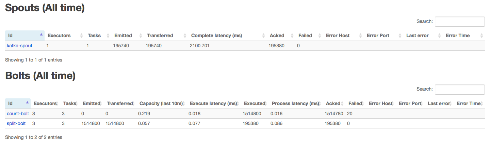

## sQ1 Kafka Integration with Storm

#### a. Multi-node Kafka Cluster Setup.

Commands:

```bash
# download and config kafka
wget http://ftp.cuhk.edu.hk/pub/packages/apache.org/kafka/2.1.0/kafka_2.11-2.0.1.tgz
tar -zxvf kafka_2.11-2.0.1.tgz
vim ~/.bashrc
source ~/.bashrc

# download and config zookeeper
wget http://ftp.cuhk.edu.hk/pub/packages/apache.org/zookeeper/stable/zookeeper-3.4.13.tar.gz
tar -zxvf zookeeper-3.4.13.tar.gz
cd zookeeper-3.4.13/conf
cp zoo_sample.cfg zoo.cfg
vim zoo.cfg

# add into zoo.cfg
#dataDir=/home/yongbiaoai/configs/zookeeper/data
#dataLogDir=/home/yongbiaoai/configs/zookeeper/log
#server.1=instance-1:12888:13888
#server.2=instance-2:12888:13888
#server.3=instance-3:12888:13888

# sync configs and packages
for i in {2,3}; do scp -r ./zookeeper-3.4.13 instance-$i:~/pkgs; done
for i in {2,3}; do scp -r ./configs instance-$i:~/; done

# set myid in each zookeeper node
echo "1" > ~/configs/zookeeper/data/myid
echo "2" > ~/configs/zookeeper/data/myid
echo "3" > ~/configs/zookeeper/data/myid

# start zookeeper service
zkServer.sh start
# check status
zkServer.sh status
zookeeper-shell.sh 10.142.0.2:2181 # enter zookeeper client  

# modify kafka config
vim kafka_2.11-2.1.0/config/server.properties
#broker.id=(depends)
#port=9092
#num.partitions=2
#zookeeper.connect=instance-1:2181,instance-2:2181,instance-3:2181

# start kafka now
kafka-server-start.sh -daemon ./config/server.properties
kafka-server-stop.sh # if stop

kafka-topics.sh --create --zookeeper 10.142.0.2:2181 --replication-factor 2 --partitions 2 --topic my-test-topic

# In instance 1
kafka-console-producer.sh --broker-list 10.142.0.2:9092 --topic my-test-topic

# In instance 2
kafka-console-consumer.sh --bootstrap-server 10.142.0.2:9092 --topic my-test-topic --from-beginning

netstat -plnt | grep 9092 # check port
```

Results:

```text
# In producer machine
yongbiaoai@instance-1:~/pkgs/kafka_2.11-2.0.1$ kafka-console-producer.sh --broker-list 10.142.0.2:9092 --topic my-test-topic

>my test message from producer
>

# In consumer machine
yongbiaoai@instance-2:~/pkgs/kafka_2.11-2.0.1$ kafka-console-consumer.sh --bootstrap-server 10.142.0.2:9092 --topic my-test-topic --from-begiing

my test message from producer
```

#### b. Find the most Frequently used Words: Using Kafka to Guarantee Message/Tuple Processing (At-least-once mode).

Commands:

```bash
kafka-server-start.sh -daemon ~/pkgs/kafka_2.11-2.0.1/config/server.properties

# Create wordcount topic
kafka-topics.sh --create --zookeeper 10.142.0.2:2181 --replication-factor 2 --partitions 2 --topic wordcount

# Kafka producer read from local StormData.txt file
cat StormData.txt | kafka-console-producer.sh --broker-list 10.142.0.2:9092 --topic wordcount

# testing
kafka-console-consumer.sh --bootstrap-server 10.142.0.2:9092 --topic wordcount --from-beginning
kafka-topics.sh  --delete --zookeeper 10.142.0.2:2181 --topic wordcount

# compile and run wordcount program
mvn compile
mvn assembly:assembly -DdescriptorId=jar-with-dependencies

storm jar target/hw2-1.0-SNAPSHOT-jar-with-dependencies.jar  wordcount.WordCountTopology WordCount
```

**Top 10 most frequently used words**

```text
the	80777
and	52754
of	47002
to	25474
I	23545
in	19697
that	18188
And	18141
a	17507
his	13299
```


**Do they generate the same result? Why or why not?**

The at most-once and at least-once models generate the **same** top used words result. 

This is because `KafkaSpout` have implement `ack` and `fail` methods for fault tolerance. When the tuple have been failed processing in `SplitSentenceBolt`, the `KafkaSpout` is able to re-emit to tuple to `SplitSentenceBolt`. Since I have use tuple-anchoring in the `SplitSentenceBolt`, which will assgin a `MessageId` to the tuple and `KafkaSpout` is able to re-emit the tuple even when `WordCountBolt` have failed on tuple processing.

**Compare the performance of these two models (including running time, num of tuple emitted, number of tuples acked, etc.).**

|Type|Running Time|Num of Emitted|Num of Acked|
|---|---|---|---|
|At Most-Once Model|51s|1710120|1710020|
|At Least-Once Model|82s|1709100|1905500|

Explains:

* At Most-Once model is faster, there are mainly two reasons:
	1. The spout was implements with `FileReadSpout`, which have less latency and overhead on the read phase. Since the StormData.txt is not a large dataset, which make this option a time-consuming phase.
	2. At Most-Once Model do not need to process ack, fail and re-emit operations, which can save a lot of time.
* At Least-Once Model need more ack operations, since in the `FileReadSpout`, I haven't implement the `ack` and `fail` operations. In the `KafkaSpout`, the spout will do more ack operatins for fault tolerance.

#### c. Scaling the topology.

Screenshots of 4 settings:

**Setting 1**


**Setting 2**



**Setting 3**


**Setting 4**


||# of KafkaSpout|# of SplitBolt|# of CountBolt|Running Time|Num of Emitted|Num of Acked|
|---|---|---|---|---|---|---|
|1|3|3|3|72s|1709160|1905540|
|2|1|3|3|51s|1710540|1905540|
|3|1|1|3|65s|1707420|1905540|
|4|3|10|10|67s|1709760|1905540|

**Explain your findings.**

1. The parallelism degree will not change the total number of acked tuples in the topology.
2. The total number of emited tuples is around 1709000, which is not fixed. The reason for this is bolts may have some failed tuples, so the spout have to re-emit tuple and this will cause the increase of the emit count. In this test, setting3 have 20 failed ack and setting4 have 40 failed ack.
3. Setting 2 have the shortest running time, which is because:
	* Have less spout number compared with Setting 1, which will have less time consuming overhead.
	* Have more SentenceSplitBolt compared with Setting 3, which means there will be more threads to processing tuples from the spout, the paraellism is suitable and the running time will be reduced.
	* The parallelism looks more reasonable than the Setting 4, the overall cluster resouces were limited, the configuration for setting 4 will have much more overhead compared with setting 3.

#### d. Find popular hashtags: Using Kafka to Guarantee Message/Tuple Processing (At-least-once model)

Commands:

```bash
# Create wordcount topic
kafka-topics.sh --create --zookeeper 10.142.0.2:2181 --replication-factor 2 --partitions 2 --topic twitter

# compile and run application
mvn compile
mvn assembly:assembly -DdescriptorId=jar-with-dependencies
storm jar target/hw2-1.0-SNAPSHOT-jar-with-dependencies.jar  twitter.TwitterHashTagTopology TwitterHashTag

# testing
kafka-console-consumer.sh --bootstrap-server 10.142.0.2:9092 --topic twitter --from-beginning
```

I have executed this program with `TwitterHashTag` and `TwitterProducer` topologies about 2 days:


**Part of Resutls:**

```text
...
Popular HashTag:Acte17	Frequency:329 (at 2019/03/10 16:55:08)
Popular HashTag:Trump	Frequency:488 (at 2019/03/10 16:55:08)
Popular HashTag:Quimper	Frequency:329 (at 2019/03/10 16:55:08)

Popular HashTag:Acte17	Frequency:323 (at 2019/03/10 17:05:08)
Popular HashTag:Trump	Frequency:482 (at 2019/03/10 17:05:08)
Popular HashTag:Quimper	Frequency:323 (at 2019/03/10 17:05:08)

Popular HashTag:Acte17	Frequency:325 (at 2019/03/10 17:15:08)
Popular HashTag:Trump	Frequency:473 (at 2019/03/10 17:15:08)
Popular HashTag:Quimper	Frequency:325 (at 2019/03/10 17:15:08)

Popular HashTag:Acte17	Frequency:326 (at 2019/03/10 17:25:08)
Popular HashTag:Trump	Frequency:470 (at 2019/03/10 17:25:08)
Popular HashTag:Quimper	Frequency:326 (at 2019/03/10 17:25:08)
...
```

**Performance**

|Name|Detail|
|---|---|
|Running Time|1d 22h 52m 32s|
|Num of Emitted|3951400|
|Num of Acked|4999720|
|Num of Failed|59802|

**TwitterHashTag Summary:**


**TwitterProducer Summary:**


## Q2 PageRank Algorithm on GraphLab Create

#### a. Install GraphLab Create on one single machine. In your homework submission, show the key steps.

Commands:

```bash
# install conda and GraphLab
wget https://repo.continuum.io/archive/Anaconda2-4.0.0-Linux-x86_64.sh
bash Anaconda2-4.0.0-Linux-x86_64.sh
conda create -n py27 python=2.7
source activate py27
conda update pip
pip install --upgrade --no-cache-dir https://get.graphlab.com/GraphLab-Create/2.1/1155114481@link.cuhk.edu.hk/F307-27C7-2B04-8358-DE14-617B-4643-2512/GraphLab-Create-License.tar.gz
conda install ipython-notebook
```

#### b. Read the code, understand how it works and write your own PageRank program or modify the code to compute the Top 100 nodes for the given dataset.

The result for the Top-100 nodes:

```text
+--------+---------------+-------------------+
|  __id  |    pagerank   |      l1_delta     |
+--------+---------------+-------------------+
| 597621 | 564.270596318 | 6.56425527268e-08 |
| 41909  | 562.686194661 | 8.51960066939e-08 |
| 163075 |  552.22403529 | 2.96643065667e-08 |
| 537039 | 549.064264229 | 5.95294977757e-08 |
| 384666 | 480.684503412 | 6.53718075228e-08 |
| 504140 | 467.382084177 | 5.21148990629e-08 |
| 486980 | 442.840154736 | 7.91470711192e-09 |
| 605856 | 438.573242895 | 7.23275661585e-09 |
| 32163  | 435.284706147 | 4.72654164696e-08 |
| 558791 | 433.216372319 | 1.22695382743e-08 |
| 551829 | 428.841584036 | 7.70995711719e-09 |
| 765334 | 417.213198757 | 8.96556571206e-08 |
| 751384 | 403.904034867 | 1.17111653708e-08 |
| 425770 | 380.577691948 | 2.30544969781e-08 |
| 908351 | 379.204344079 | 3.63850745089e-08 |
| 173976 |  372.10491987 | 9.91559545582e-09 |
|  7314  | 365.657011704 | 1.81207155947e-08 |
| 213432 | 363.672307797 | 1.50967593981e-08 |
| 885605 | 358.624602009 | 1.97803728952e-09 |
| 819223 | 355.695810701 | 3.08767198476e-08 |
| 691633 | 354.738879949 | 1.54465169544e-08 |
| 452291 | 349.521284086 | 4.60057663076e-08 |
| 407610 | 346.156635944 | 5.91393245486e-09 |
| 905628 |  344.02950701 | 9.53506855694e-08 |
| 459074 | 343.923236123 | 3.42533326148e-08 |
| 687325 | 338.160096556 | 3.98960082748e-08 |
| 396321 | 336.475102638 |  2.6488066851e-08 |
| 828963 | 334.949200109 | 4.31373337051e-09 |
| 226374 | 324.520785064 | 5.01146359966e-08 |
| 172133 |  323.23839106 | 1.71191913978e-08 |
| 277876 | 321.536152794 | 1.32383775053e-08 |
| 599130 | 310.389768204 | 1.44340788211e-08 |
| 448961 | 310.196546929 | 1.48726257976e-08 |
| 324502 | 304.824598715 |  2.4587450298e-08 |
| 804489 | 299.762249103 | 1.19941887533e-08 |
| 726490 | 297.979939501 | 3.89461547456e-08 |
| 486434 | 295.618609471 | 8.05380295787e-09 |
| 182121 | 291.732362552 | 3.44629711435e-08 |
| 323129 | 290.238558437 | 2.89907120532e-09 |
| 54147  | 289.827725514 | 6.84281076246e-10 |
| 621670 | 284.778678258 | 1.87563955478e-08 |
| 555924 |  282.38369521 | 6.09776407146e-09 |
| 587935 | 277.338504661 | 1.99733563022e-08 |
| 245186 | 277.135628242 | 1.14708313959e-08 |
| 721816 | 276.854810151 | 4.05583477914e-09 |
| 57791  | 274.755178788 | 1.52445522872e-08 |
| 185067 | 269.101026078 | 3.88075704905e-09 |
| 402132 | 265.738492426 | 2.62905359705e-08 |
| 74397  | 265.193802155 | 4.24836343882e-09 |
| 434134 |  263.27072434 | 1.88653075384e-08 |
| 185821 | 260.995336751 | 1.89924094229e-08 |
| 870811 | 260.882437173 | 2.24525820158e-09 |
| 191990 | 260.714848454 | 1.38940094985e-08 |
| 21682  | 260.705514372 | 5.59828094993e-09 |
| 399699 | 258.875290251 | 4.38637925981e-09 |
| 438491 | 248.200491416 | 2.28712337957e-09 |
| 614831 | 240.429665476 | 2.40191013745e-08 |
| 183501 | 239.060645124 | 4.77507455798e-09 |
| 846221 | 237.235623036 | 5.92251581111e-10 |
| 36292  | 236.587344574 | 1.26798056499e-08 |
| 666882 | 234.976026249 | 1.39650069286e-09 |
|  1536  | 232.405902519 |  8.3987600874e-08 |
| 468736 | 231.886549247 | 1.28403883082e-08 |
| 699754 | 229.741580344 | 5.44642375644e-09 |
| 354640 | 226.636267191 | 2.53294274444e-09 |
| 187242 | 221.184680153 | 5.83381165598e-09 |
| 715883 | 220.725485173 |  3.745583399e-09  |
| 596972 | 219.229688219 | 4.52433823739e-09 |
| 232639 |  215.81671379 | 7.57835891818e-08 |
| 626893 | 215.008908514 |  7.1478297059e-08 |
| 587721 | 210.617604691 | 3.59966634278e-09 |
| 557124 | 207.993754406 | 2.11775841308e-09 |
| 818382 | 207.702171646 | 8.61439275468e-09 |
| 466323 | 202.038560458 | 1.09532436454e-08 |
| 495084 | 200.626762931 |  2.6222409133e-08 |
| 798584 |  199.96277118 | 5.67140148178e-08 |
| 438493 | 197.907898312 | 4.05938749282e-09 |
| 522190 | 194.694389645 | 3.66949279851e-08 |
| 483532 | 194.525311381 |  6.4607661443e-09 |
| 637936 | 192.899220044 | 1.00155261862e-08 |
| 223236 | 192.696284386 | 8.17303202894e-09 |
| 837478 | 191.372046033 | 2.02973637897e-09 |
| 227675 | 190.580382966 | 2.51192773248e-08 |
| 138746 | 189.752245614 | 2.43900046826e-08 |
| 812640 | 184.393122699 | 2.31221406466e-08 |
| 298511 | 183.297685266 | 7.44014982956e-09 |
| 369102 | 179.009139917 | 5.67491724723e-08 |
| 772466 | 177.905595922 | 1.76979426669e-08 |
| 427629 | 177.854276593 | 1.52253392116e-08 |
| 655158 | 173.659939765 | 3.39227597124e-08 |
| 717644 | 166.161639065 | 2.01347916118e-08 |
| 133962 | 166.134131862 | 4.93731135975e-08 |
| 260644 | 162.435653211 | 4.27601776209e-09 |
| 704396 | 162.364053751 | 2.29277929975e-09 |
| 914474 |  160.90338044 | 4.48733783287e-06 |
| 673065 |  160.78087098 | 1.66801328305e-09 |
| 48888  | 160.062488433 | 1.95063023511e-08 |
|  8316  | 157.926984603 | 4.66275196231e-09 |
| 564521 | 157.681336574 | 5.96907057115e-09 |
| 839863 | 156.166810576 | 1.90820165074e-05 |
+--------+---------------+-------------------+
[875713 rows x 3 columns]
```

#### c. Change the threshold for convergence and maximum iterations in your code and run at least three times with different parameters.

Commands:

```bash
nohup python pagerank_graphlab.py --threshold 0.001 --max_iteration 20 > log_1.txt &
nohup python pagerank_graphlab.py --threshold 10 --max_iteration 20 > log_2.txt &
nohup python pagerank_graphlab.py --threshold 1 --max_iteration 100 > log_3.txt &
nohup python pagerank_graphlab.py --threshold 0.001 --max_iteration 1000 > log_4.txt &
nohup python pagerank_graphlab.py --threshold 0.1 --max_iteration 1000 > log_5.txt &
nohup python pagerank_graphlab.py --threshold 10 --max_iteration 1000 > log_6.txt &

nohup python pagerank_graphlab.py --threshold 10 --max_iteration 30 > log_7.txt &
nohup python pagerank_graphlab.py --threshold 10 --max_iteration 35 > log_8.txt &
nohup python pagerank_graphlab.py --threshold 10 --max_iteration 40 > log_9.txt &
nohup python pagerank_graphlab.py --threshold 10 --max_iteration 45 > log_10.txt &
```

Results:

||Threshold|Max Iterations|Num of Iterations|Time Cost|Final Loss|
|---|---|---|---|---|---|
|Setting 1|0.001|20|20|8699s|1207|
|Setting 2|10|20|20|8598s|1207|
|Setting 3|1|100|61|12464s|0.867|
|Setting 4|0.001|1000|102|16785s|0.0009|
|Setting 5|0.1|1000|74|17045s|0.098|
|Setting 6|10|1000|47|14210s|9.374|
|Setting 7|10|30|30| 12406s    |186|
|Setting 8|10|35|35|14041s|76|
|Setting 9|10|40|40|15139s|31|
|Setting 10|10|45|45|15603s|13|

1. The threshold and max iteration may influence the final loss, however, in each settings, the total loss at the same iteration is the same.
2. The actual number of iterations will influence the result of final loss.
3. The top-100 nodes will not change after iteration 25.

**Explains:**

1. Threshold will limit the the stopped loss and max iteration number will limit the actual number of iterations. The calculate proceduces for pagerank is fixed for each settings, so the total loss for the same iteration will be the same.
2. Since the total loss at same iteration will be same, so the actual iteration number is the only factor that may related to the total loss.
3. After certain iterations, the updated delta for each node will be too small to change the rank of the top-100 nodes. So the top-100 nodes will keep the same after certain iteration.

## Notes

* Kafka should install version below or equals to 2.0.1, otherwise there will exist LEADER_NOT_AVAILABLE problem in the produce phase, which I haven't idea about how to fix.
* For higher Kafka (version higher and equals to 2.0.1), the storm should use higher version library. Otherwise, there will be connection problem between kafka and storm.